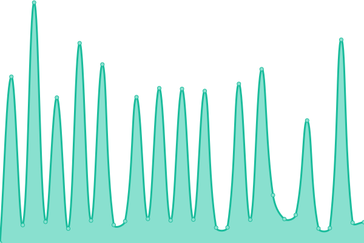
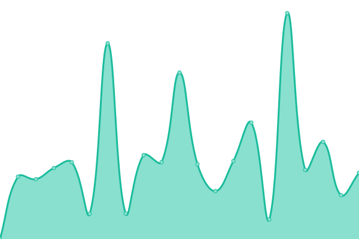
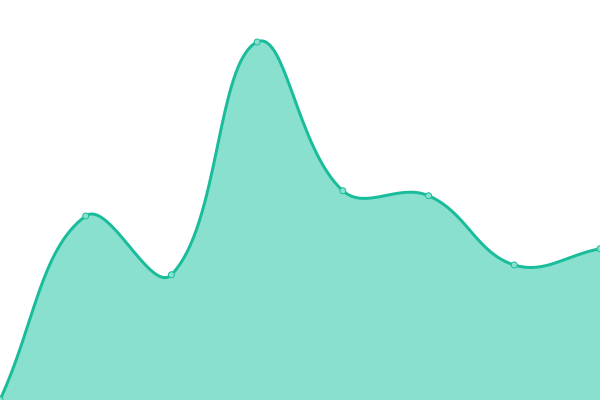
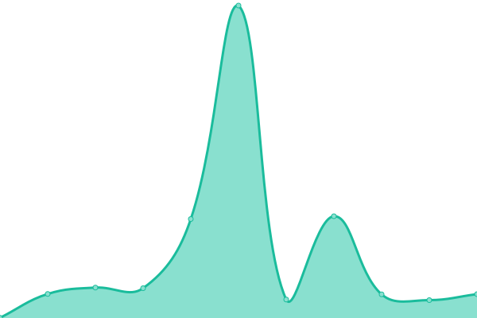
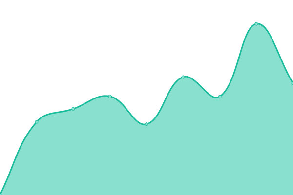

# [📈 Live Status](https://stamateas.github.io): <!--live status--> **🟧 Partial outage**

This repository contains the open-source uptime monitor and status page for [Upptime](https://upptime.js.org), powered by [Upptime](https://github.com/upptime/upptime).

With [Upptime](https://upptime.js.org), you can get your own unlimited and free uptime monitor and status page, powered entirely by a GitHub repository. We use [Issues](https://github.com/upptime/upptime/issues) as incident reports, [Actions](https://github.com/stamateas/upptime/actions) as uptime monitors, and [Pages](https://stamateas.github.io) for the status page.

<!--start: status pages-->
<!-- This summary is generated by Upptime (https://github.com/upptime/upptime) -->
<!-- Do not edit this manually, your changes will be overwritten -->
<!-- prettier-ignore -->
| URL | Status | History | Response Time | Uptime |
| --- | ------ | ------- | ------------- | ------ |
|  [Recatt Server](https://recatt.its-telekom.eu) | 🟥 Down | [recatt-server.yml](https://github.com/stamateas/upptime/commits/HEAD/history/recatt-server.yml) | 

 1660ms
     
 | 

<a href="https://status.its-telekom.eu/history/recatt-server">0.00%</a>
    

|  [GitLab Server](https://gitlab01.its-telekom.eu) | 🟩 Up | [git-lab-server.yml](https://github.com/stamateas/upptime/commits/HEAD/history/git-lab-server.yml) | 

 1589ms
     
 | 

<a href="https://status.its-telekom.eu/history/git-lab-server">100.00%</a>
    

|  [Jenkins Server](https://jenkins01.its-telekom.eu/) | 🟩 Up | [jenkins-server.yml](https://github.com/stamateas/upptime/commits/HEAD/history/jenkins-server.yml) | 

 656ms
     
 | 

<a href="https://status.its-telekom.eu/history/jenkins-server">100.00%</a>
    

|  [ReportPortal Server](https://reporting.its-telekom.eu/) | 🟩 Up | [report-portal-server.yml](https://github.com/stamateas/upptime/commits/HEAD/history/report-portal-server.yml) | 

 800ms
     
 | 

<a href="https://status.its-telekom.eu/history/report-portal-server">100.00%</a>
    

|  [Authentication Server](https://auth.its-telekom.eu/) | 🟩 Up | [authentication-server.yml](https://github.com/stamateas/upptime/commits/HEAD/history/authentication-server.yml) | 

 135ms
     
 | 

<a href="https://status.its-telekom.eu/history/authentication-server">100.00%</a>
    

|  [Mattermost Server](https://mattermost.its-telekom.eu/) | 🟩 Up | [mattermost-server.yml](https://github.com/stamateas/upptime/commits/HEAD/history/mattermost-server.yml) | 

 627ms
     
 | 

<a href="https://status.its-telekom.eu/history/mattermost-server">100.00%</a>
    

|  [Proxima/DNS Server](http://proxima01.its-telekom.eu/livewatch.php) | 🟩 Up | [proxima-dns-server.yml](https://github.com/stamateas/upptime/commits/HEAD/history/proxima-dns-server.yml) | 

 821ms
     
 | 

<a href="https://status.its-telekom.eu/history/proxima-dns-server">100.00%</a>
    

|  Secret Site | 🟥 Down | [secret-site.yml](https://github.com/stamateas/upptime/commits/HEAD/history/secret-site.yml) | 

 1173ms
     
 | 

<a href="https://status.its-telekom.eu/history/secret-site">0.00%</a>
    

<!--end: status pages-->

[**Visit our status website →**](https://stamateas.github.io)

## 📄 License

- Powered by: [Upptime](https://github.com/upptime/upptime)
- Code: [MIT](./LICENSE) © [Upptime](https://upptime.js.org)
- Data in the `./history` directory: [Open Database License](https://opendatacommons.org/licenses/odbl/1-0/)
