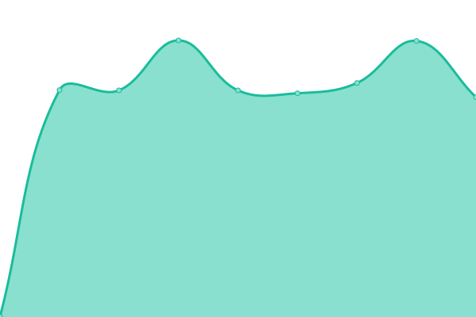

# [📈 Live Status](https://stamateas.github.io): <!--live status--> **🟩 All systems operational**

This repository contains the open-source uptime monitor and status page for [Upptime](https://upptime.js.org), powered by [Upptime](https://github.com/upptime/upptime).

With [Upptime](https://upptime.js.org), you can get your own unlimited and free uptime monitor and status page, powered entirely by a GitHub repository. We use [Issues](https://github.com/upptime/upptime/issues) as incident reports, [Actions](https://github.com/upptime/upptime/actions) as uptime monitors, and [Pages](https://stamateas.github.io) for the status page.

<!--start: status pages-->
<!-- This summary is generated by Upptime (https://github.com/upptime/upptime) -->
<!-- Do not edit this manually, your changes will be overwritten -->
<!-- prettier-ignore -->
| URL | Status | History | Response Time | Uptime |
| --- | ------ | ------- | ------------- | ------ |
|  [Recatt](https://recatt.its-telekom.eu) | 🟩 Up | [recatt.yml](https://github.com/stamateas/upptime/commits/master/history/recatt.yml) | 

 1667ms
     
 | 

<a href="https://status.stamateas.de/history/recatt">100.00%</a>
    

|  [GitLab](https://gitlab01.its-telekom.eu) | 🟩 Up | [git-lab.yml](https://github.com/stamateas/upptime/commits/master/history/git-lab.yml) | 

 2112ms
     
 | 

<a href="https://status.stamateas.de/history/git-lab">100.00%</a>
    

|  [Jenkins](https://jenkins01.its-telekom.eu/) | 🟩 Up | [jenkins.yml](https://github.com/stamateas/upptime/commits/master/history/jenkins.yml) | 

 795ms
     
 | 

<a href="https://status.stamateas.de/history/jenkins">30.14%</a>
    

|  [ReportPortal](https://reporting.its-telekom.eu/) | 🟩 Up | [report-portal.yml](https://github.com/stamateas/upptime/commits/master/history/report-portal.yml) | 

 906ms
     
 | 

<a href="https://status.stamateas.de/history/report-portal">100.00%</a>
    

|  [Autentication Server](https://auth.its-telekom.eu/) | 🟩 Up | [autentication-server.yml](https://github.com/stamateas/upptime/commits/master/history/autentication-server.yml) | 

 242ms
     
 | 

<a href="https://status.stamateas.de/history/autentication-server">100.00%</a>
    

|  [Mattermost Server](https://mattermost.its-telekom.eu/) | 🟩 Up | [mattermost-server.yml](https://github.com/stamateas/upptime/commits/master/history/mattermost-server.yml) | 

 983ms
     
 | 

<a href="https://status.stamateas.de/history/mattermost-server">100.00%</a>
    

|  [Proxima Server](http://proxima01.its-telekom.eu/) | 🟩 Up | [proxima-server.yml](https://github.com/stamateas/upptime/commits/master/history/proxima-server.yml) | 

 705ms
     
 | 

<a href="https://status.stamateas.de/history/proxima-server">100.00%</a>
    

<!--end: status pages-->

[**Visit our status website →**](https://stamateas.github.io)

## 📄 License

- Powered by: [Upptime](https://github.com/upptime/upptime)
- Code: [MIT](./LICENSE) © [Upptime](https://upptime.js.org)
- Data in the `./history` directory: [Open Database License](https://opendatacommons.org/licenses/odbl/1-0/)
